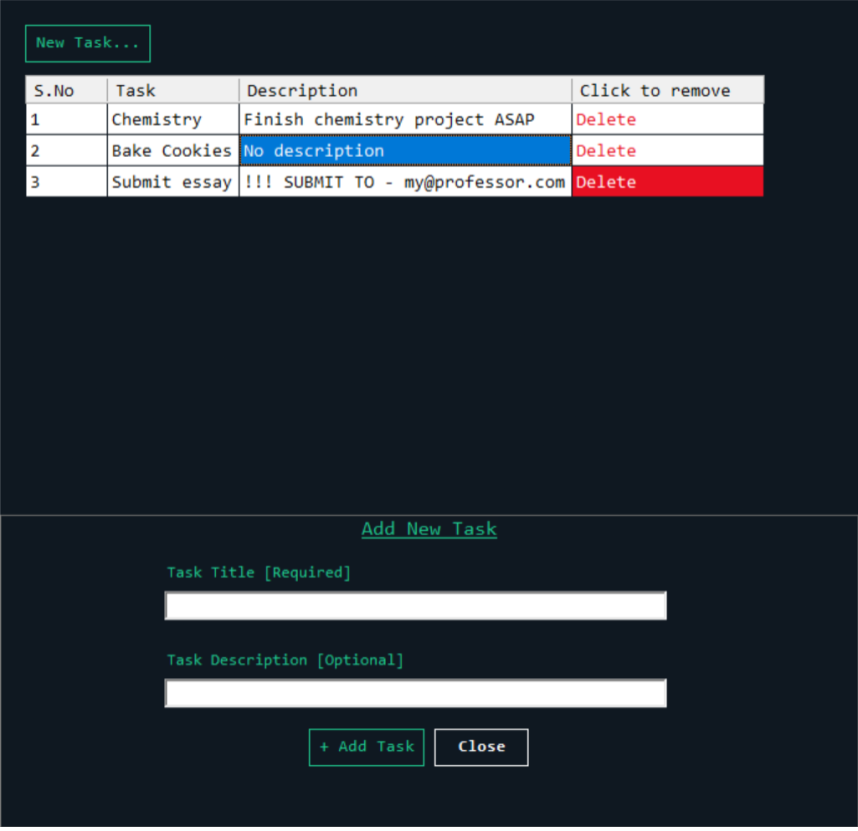

# TodoList

A list maker which can be used for managing tasks. Tasks can be added and removed as well. App made with implementation of Winforms and Database

  
###### *Image: Preview of the app*
  

## Table of Contents

- [Features](https://github.com/SrNightmare09/todolist#features)
- [Dependencies](https://github.com/SrNightmare09/todolist#dependencies)
- [Bugs](https://github.com/SrNightmare09/todolist#bugs)
- [Upcoming Features](https://github.com/SrNightmare09/todolist#upcoming-features)
- [Contributing](https://github.com/SrNightmare09/todolist#contributing)
- [MIT License](https://github.com/SrNightmare09/todolist#license)

## Features

- [x] Tasks can be added/removed
- [x] Live reloading
- [x] Tasks can be added with an additional optional description
- [x] User-friendly GUI

## Dependencies

None

## Bugs

- [Improper behaviour of Delete button](https://github.com/SrNightmare09/todolist/issues/3)

## Upcoming Features

- [ ] Different color backgrounds
- [ ] Option to edit tasks
- [ ] Usage of SQL database for storing tasks
- [ ] Smoother usage
- [ ] Build as complete application with easy installation

## Contributing

Contributions are always welcome!

See [`CONTRIBUTING.md`](https://github.com/SrNightmare09/todolist/blob/master/CONTRIBUTING.md) for ways to get started.

Please adhere to this project's [`CODE OF CONDUCT`](https://github.com/SrNightmare09/todolist/blob/master/CODE_OF_CONDUCT.md)

## License

[MIT](https://github.com/SrNightmare09/todolist/blob/master/LICENSE)
